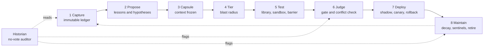

# Part A - How we designed it, and what it looks like

Companion file: `02-standards-and-advisory-board-review.md` (Part B).

## 1. The problem

A system that learns from experience has two linked weaknesses:

1. **Context and memory slip.** Over time the situation a lesson came from is forgotten.
2. **Bad lessons harden.** If the system stores conclusions and throws away the evidence, nobody can audit a rule later, and wrong rules become habits.

Four sources of bad lessons drove the whole design:

- **Luck read as skill:** the dish sold well because it rained.
- **The cook grading their own plate:** the agent's self-report is the only evidence.
- **Overreach:** a lesson from one context applied to all of them.
- **Compounding drift:** a small wrong lesson becomes the base for the next one.

## 2. How we worked

- **Working agreement.** Phase 1 Design (no code until a plain-English design is agreed), Phase 2 Build, Phase 3 Retro. This document is the output of Phase 1, before the Advisory Board and standards review in Part B.
- **The Lever Method for every decision.** Overview, two or three levers with their trade-offs, your choice, the test, the connection back to your projects.
- **Decomposition.** Midway you proposed the pre-AI habit of breaking a problem into sub-processes and working each in order. We turned the whole system into eight stations and took them one at a time, each with its purpose, main risk, levers and a decision.
- **Peer stance.** Pushback was part of the process. Several decisions changed because of it: compaction and retirement were separated; a barrier between roles was shown not to replace a different model; the judge-led design gained calibration underneath it; the system starts heavy and earns the light path; novelty can only raise a change's scrutiny.
- **Ideas Shelf.** Tangents were parked, not chased (see section 7).

## 3. Foundation decisions (before the eight stations)

| Question | Options weighed | Decision | Why |
|---|---|---|---|
| How does a lesson become standing knowledge? | Repeat confirmation; replay before adoption; independent judge | Replay before adoption combined with an independent judge | Tight check; catches regressions and self-grading |
| What if the original context is forgotten? | Context capsule; re-derivation on change; decay by default | Capsule as the base, re-derivation triggered by environment change | Forgetting becomes visible and safe |
| Retire a lesson vs compact evidence | Treat as one decision; treat separately | Separate decisions with four storage tiers | A lesson is a claim; an episode is a record. Compaction is irreversible |
| Big changes | Evaluator tests own change; fixed library; reviewer approves plan | Fixed library for simple changes, designed tests with a separate reviewer and sandbox for complex ones | Avoids the cook writing the tasting criteria for their own dish |
| Barrier or different model? | Barrier only; different model; mechanical checks | Barrier at every tier, different model for the complex tier, mechanical checks underneath | Barrier stops leakage; a different model stops shared blind spots |
| Distillation and shared lineage | Trust brand labels; measure independence | Measure independence by comparing where models fail, re-run on every model swap | Similar models can share blind spots whatever they are called |

## 4. The end-to-end design

| # | Station | Job | Main risk |
|---|---|---|---|
| 1 | Capture | Record raw episodes and who judged the outcome | Agent marking its own work |
| 2 | Propose | Draft candidate lessons and hypotheses | Luck read as skill; originality starved |
| 3 | Capsule | Freeze the situation and attach it to the lesson | Missing the detail that mattered |
| 4 | Tier | Set the change's route by blast radius | A big change misfiled as small |
| 5 | Test | Prove or break the change before it acts | Leakage, contaminated held-out cases, shared blind spots |
| 6 | Judge | Decide standing; check conflicts | Judge bias; contradicting lessons |
| 7 | Deploy | Let the lesson meet live decisions safely | Shadow not matching reality; delayed harm |
| 8 | Maintain | Keep the store honest over time | Rare-but-critical lessons decaying; wrong vs world-moved-on |

### Station 1 - Capture
- Immutable full trace plus a mechanical index on top (index is for finding, never for rewriting).
- Each episode records the situation, actions, outcome and a fingerprint (model, tools, data versions).
- **Outcome source:** an independent judge is primary, calibrated against mechanical checks and planted flaws. You see only cases where the layers persistently disagree.
- Every outcome carries a source stamp (mechanical, judge or human), the judge's model and version, the rubric version, and what the judge was allowed to see.
- The agent's self-assessment is kept as a routing signal only, never as evidence.

### Station 2 - Propose
- **Two lanes.** Lessons come from patterns and from contrast (success against failure in similar situations); failures are exempt from the pattern rule. Every lesson carries a claim, citations, a scope and a falsifier.
- **Hypotheses** enter freely with no standing, and must state a falsifier and a cheap experiment.
- **Waterfall by blast radius:** exploration budget for low reach, sandbox trial for medium, novelty-flagged heavy scrutiny for high reach.
- The learner cannot pick its own rung. Budgets are enforced from outside, measured in time locally. Rejected ideas go to a graveyard with reasons.
- Reward attaches to verified outcomes, never to novelty. The mix of novel and routine proposals is monitored.

### Station 3 - Capsule
- Mechanical fields plus a pointer to the raw episodes, plus the learner's "what mattered" claim, which is treated as a hypothesis and tested by replay.
- Matching returns a degree of fit, not yes or no; near-misses are logged as evidence.
- **Ontology:** small hand-built core (10 to 20 terms), learner proposals only through the hypothesis lane, an "unclassified" bucket to show gaps. Seven-rule ruleset is in `stage-3-capsule-and-ontology-ruleset.md`.

### Station 4 - Tier
- A static count of what the change touches sets a provisional tier. A dry run against past episodes can raise it, never lower it.
- Thin dry-run coverage counts as unknown, and unknown routes heavy. Hard-to-undo changes go heavy regardless of size.
- The system starts heavy. The light path opens only once sampled audits show a low measured misfile rate.
- The learner may ask for a higher tier, never a lower one. Novelty raises a change by one rung, never lowers it.

### Station 5 - Test
- **Fixed library** with four kinds of case: pinned failures, known-good cases, planted flaws, conflict pairs. Additions are locked before a change is shown.
- **Held-out cases** use three protections together: information rules everywhere, rotating pools on the light path, burn-on-use for the heavy tier.
- **Repeat-and-quarantine:** every test and judge verdict runs several times and records a pass rate; unstable ones carry no weight.
- **Metamorphic checks** (rephrase, add irrelevant detail, reorder; verdict should hold). Mutation testing comes second, once tests are stable.
- Complex changes get a designed test plan approved by a separate reviewer, run in an air-gapped sandbox with a different-lineage test designer and an information barrier.

### Station 6 - Judge
- Different lineage from the learner, blind to the learner's reasoning, versioned and outside the learner's reach.
- **Conflict check:** the ontology spots overlapping lessons that prescribe opposite things; resolve by narrowing scope, superseding the weaker lesson, or escalating.
- **Gate:** tiered standing on top of hard vetoes. A mechanical failure, an unresolved conflict or an unstable verdict means no standing; otherwise full or provisional standing.
- **Historian:** a no-vote auditor that reads the ledger after the fact, mostly with mechanical checks, run on change plus a light periodic sweep. It looks for inconsistency, drift and lessons that passed the gate then failed live. The judge never sees its output at judging time.

### Station 7 - Deploy
- Shadow mode, then canary against a concurrent control, then staged widening. Provisional lessons stay capped and expire unless live evidence re-confirms them.
- Rollback triggers are frozen before deployment: red lines fire immediately; relative drift against control fires over the observation window.
- A deploy record holds the change, prior state, capsule and ontology version, so rollback is a mechanical restore. One lesson per area goes live at a time.

### Station 8 - Maintain
- Lessons decay by default unless they keep earning standing. Each carries a small set of sentinel cases, shared through the ontology and run whenever the environment or ontology changes.
- Lessons from severe failures are pinned mechanically, with a cap; the historian flags a bloated pinned pile; the learner never pins.
- Retirement leaves a tombstone. "Wrong" versus "the world moved on" is decided by fingerprint attribution; where there are too few episodes to tell, the lesson is retired as unresolvable, never as wrong. Old model versions are kept only for pinned lessons.
- Compaction is mechanical and checks citations first. Failures are pinned permanently.

## 5. Invariants (the rules that hold everywhere)

1. Raw evidence is immutable.
2. Lessons are candidates until gated.
3. No role grades its own work.
4. Anything that can write a lesson can steer every future decision, so all writes go through the gate.
5. Retreat is easy; advance is hard.
6. Unknown routes heavy.
7. Never delete a lesson or term; retire or deprecate with a reason.
8. Every stamp records who or what produced it, and which version.

## 6. Decision log

| Stage | Decision | Lever chosen |
|---|---|---|
| Foundation | Gate = replay plus independent judge | 2 + 3 |
| Foundation | Capsule plus re-derivation on change | Both |
| Foundation | Tests: fixed library (simple), designed and reviewed (complex) | 2 / 3 |
| Foundation | Different model for complex-tier test design | 2 |
| 1 Capture | Immutable trace plus mechanical index | 3 |
| 1 Capture | Judge as primary outcome source, calibrated underneath | 2 |
| 2 Propose | Pattern and contrast proposals; hypothesis lane | 2 + 3, waterfall |
| 2 Propose | Blast radius sets rung; novelty raises one rung only | Agreed |
| 3 Capsule | Mechanical fields plus tested "what mattered" claim | 3 |
| 3 Capsule | Hand-built ontology core, proposals through the gate | 3 |
| 4 Tier | Static count plus dry run with ratchet; start heavy | 1 + 2 |
| 5 Test | Held-out protections combined by tier | 1 + 2 + 3 |
| 5 Test | Repeat-and-quarantine and metamorphic first; mutation second | Adopted |
| 6 Judge | Tiered standing on hard vetoes | 3 on 1 |
| 6 Judge | Historian as no-vote auditor | Agreed |
| 7 Deploy | Shadow, canary vs control, staged widening, standing caps | 2 + 3 |
| 8 Maintain | Sentinel cases plus use-based decay and capped pins | 3 + 1 |
| 8 Maintain | Fingerprint attribution; old versions only for pinned | 2 + 3 |

## 7. Open and parked items (Ideas Shelf)

- Thresholds to set with data: repeat counts, misfile-rate limit, observation windows, decay intervals, pin cap, definition of severity, sentinel count.
- The first 10 to 20 ontology terms and their competency questions.
- Comparison against the Hermes baseline (not yet done).
- Which stages may ever use external models, and what data may leave the machine.
- Build order for Phase 2 (a proposal is in Part B, section 7).

## 8. Glossary

- **Episode:** a raw record of what happened. Not a claim, so it cannot be right or wrong.
- **Lesson:** a claim that steers future decisions.
- **Capsule:** the frozen situation a lesson came from.
- **Blast radius:** how many decisions a change touches.
- **Gate:** the only route from candidate to standing knowledge.
- **Sentinel:** a small standing test case that re-verifies a lesson when the environment changes.
- **Pinned:** protected from decay because it came from a severe failure.
- **Tombstone:** the record left when a lesson is retired, with the reason.
- **Historian:** the no-vote auditor that reads the ledger over time.
- **Canary:** a small live slice compared against a control before widening.
